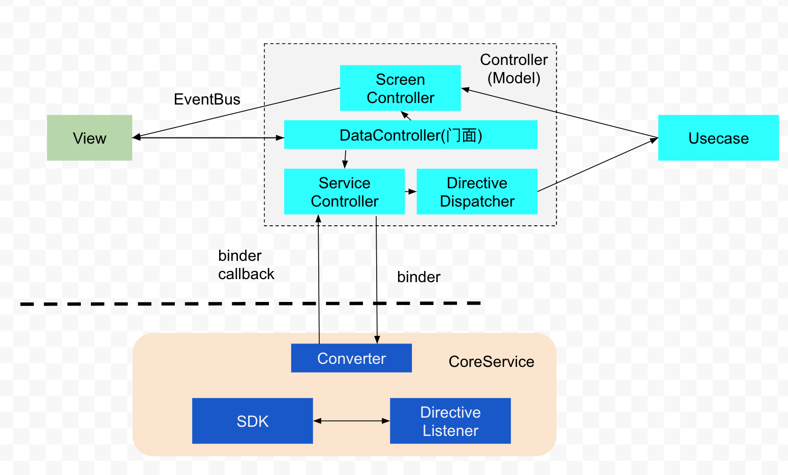

# VoiceAssist Architecture

## 应用架构简述
应用采用 MVP + Service 模式开发，以更好地对业务的职责进行划分、扩展。

## MVP模式简述
MVP模式即 Model - View - Presenter 的缩写，其为一种软件的架构思想，用以分离具体业务职责。
View为视图层，负责呈现数据、相应用户对界面的交互。Model为具体业务逻辑。View和Model为了解除耦合，
不能直接通信。Presenter是两者沟通的桥梁，处于View层和Model层之间，使用接口的方式，处理两层之间
互相通信的数据，实现View和Model层的间接沟通。

## 为什么要使用MVP？
为了提高代码的可读性、可扩展性和可测试性。同时，更有效地分离每一个业务的职责。

## 应用具体架构

### View
组成主要有Activity以及其他的显示控件，如RecyclerView.Holder、Adapter、自定义的ScrollView等。

### Presenter
主要是对各自Activity交互事件的处理。Presenter接收到Activity的请求，比如用户点击了"录音"
按钮后，Presenter会根据不同的Activity事件，调度相应的Model对此事件进行处理。当Model处理完成后，通过接口
将数据传递回Presenter。Presenter将这些数据进行加工后，通过其持有的View接口回调到View层，供界面适配。

### Model 
能够控制语音SDK的录音、接收结果返回、根据具体场景调用用例进行操作等。Controller是与SDK交互的
直接控制器，所有对SDK的操作都需要委托Controller进行通信。UseCase是针对识别场景做出相应操作的用例。

*Model*中的组件
+ Controller    
与SDK层直接交互的组件。RecordController控制录音开始、结束、查询录音状态；
TtsController控制TTS（语音转文字）的开始、结束和查询状态。CustomInteractionController控制
多轮交互的开始、结束、查询状态。
+ Manager   
为组件提供依赖，类似依赖注入。
+ UseCase
具体场景的操作。如PhonecallUsecase，处理发起打电话的操作；ApplaunchUsecase，负责打开相应应用。

### Service
提供语义解析、TTS播报服务，可被其他应用调用。由度秘SDK与SDK监听器组成。与上层通过Binder接口进行通信。

